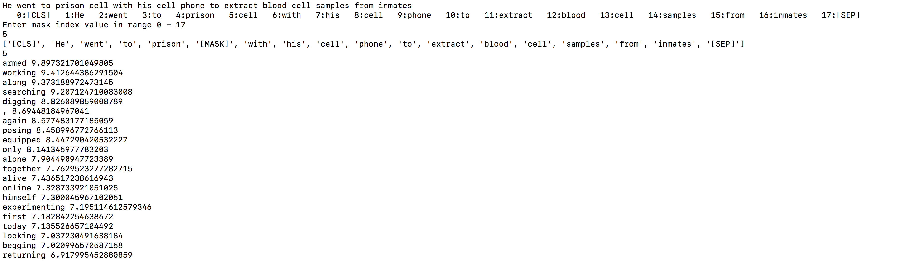
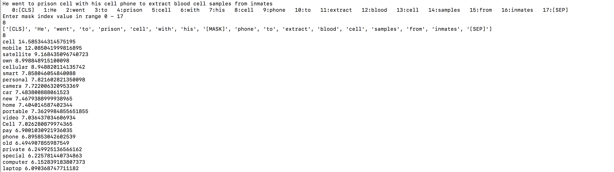
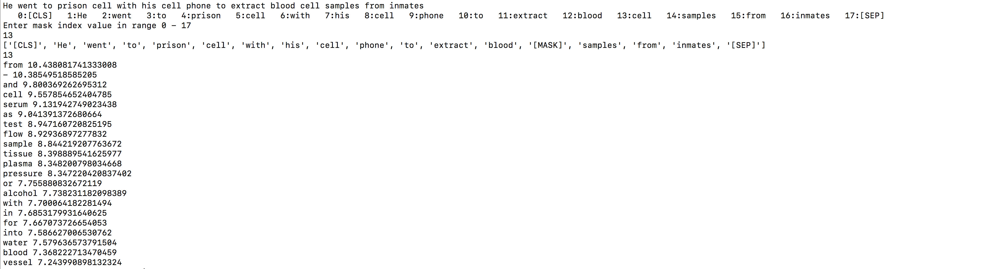

# bert_mask

This is an sample program illustrating BERTs masked language model. 
Given a sentence as input, we can specify any term _(could be a subword of a word)_ to mask and examine its neighbors, where the neighbors are terms in BERT's vocab.
We can use this for a variety of tasks
* To fill in missing puncuations in a sentence. 
* To harvest phrases of a particular entity type _(all phrases beloing to a particular entity type, are likely to share common neighbor terms in the top k neighbors in a sentence a term of that entity type occurs)_. 
* In general any task where the sentence context of a word/phrase would be useful. 

# Install steps
* Install pytorch first. This link (https://github.com/ajitrajasekharan/multi_gpu_test)   has installation instructions for pytorch
* Activate the environment if using conda

# Usage 
* python mask_word.py  _(default uses bert-base-cased model. To use custom model or other model see python mask_word.py -h for options)_ 

* To mask a word just type in "entity" in the sentence in the place of a word _(this is useful especically if the input word could potentially break into subwords)_

* To mask a phrase, just input the term "entity" in the sentence in place of it

* To mask a specific subword of a word, type in full sentence, and then used the tokenized output that is displayed to choose the speicific subword to mask

# Sample outputs
A sentence "He went to prison _cell_ with his _cell_ phone to extract blood _cell_ samples from inmates" with the word cell having different senses. 

 

 

 

The neighbors for the word "cell" in the sentence above are different for the different contexts. Note all displayed neighbors are words in BERT vocab. This test was done using pretrained model - bert-base-cased

# Data files.
BERT vector and vocab files

https://drive.google.com/file/d/1X1mE8OZVnYZnFXgZx7Wfaop7_pOLDGnP/view?usp=sharing
https://drive.google.com/file/d/1vBEOR25_ajAoNmtgoy-TFJBX-4wj5WF_/view?usp=sharing

Roberta vector and vocab files

https://drive.google.com/file/d/1izKfjzqCf1QEifSMsnaDmZt7NVe0UfpU/view?usp=sharing
https://drive.google.com/file/d/1z8gz1MPS4AmagriKlw7cMVPGIpQrJW-e/view?usp=sharing

# License

MIT License
